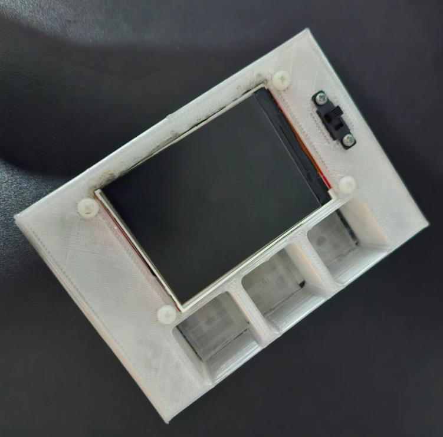

# 💊 Proyecto: Pastillero Digital con Web Server 

## Resumen del Proyecto

El Pastillero Digital actúa como como un recordatorio de medicación y un recolector de datos para resolver la problemática de las personas que olvidan tomar sus medicamentos.

El sistema utiliza un microcontrolador ESP32 para controlar los componentes físicos (pantalla, alarma y sensores de peso) y simultáneamente aloja un Web Server para la administración remota de la medicación a través de una página web.

## 💻 Hardware y Componentes

| Componente | Conexión/ Tecnología| Función Principal |
| :--- | :---: | :--- |
| **ESP32 S3** | Microcontrolador | Utilizado por su capacidad Wi-Fi  y alto rendimiento |
| **Galgas** | Puente de Wheatstone / HX711 (ADC) | Sensores de presión que detectan la presencia o el retiro de pastillas en cada compartimento |
| **Pantalla LCD TFT** | LVGL (Librería de GUI) / SPI | Visualiza la hora, fecha y la siguiente pastilla a tomar |
| **Buzzer** | Salida Digital | Activa una alarma sonora cuando llega la hora de la toma |
| **Batería de Litio (250 mAh)** |  | Autonomía para el uso portable |
| **TP4056** |  | Módulo de carga y descarga de batería |

## Desarrollo Web (Web Server)

El ESP32 aloja un servidor web para la administración remota. Se usan SPIFFS (Serial Peripheral Interface Flash File System) para almacenar y servir todos los archivos estáticos de la interfaz web en la ESP32.

| Archivo | Tecnología| Función Principal |
| :--- | :---: | :--- |
| **index.html** | HTML5 |Estructura de la interfaz de usuario |
| **estilos.css** | CSS3 |Estilos y presentación de la página |
| **script.js** | JavaScript |Lógica de negocio: Gestión local (localStorage), cálculo de tomas futuras, y comunicación asíncrona (Fetch) con el ESP32. |

## ⚙️ Características de la Programación 
* **Detección de toma de pastilla:** Se utiliza un algoritmo de detección de cambio por umbral y un tiempo de confirmación de 5 segundos para validar que una pastilla fue retirada.

* **Comunicación Cliente-Servidor:**   `handleRecibirProximaToma()`: Recibe los datos de la próxima dosis desde la página web y los almacena en el ESP32.

  `handleGetTomaNotificacion()`: Permite a la página web hacer polling al ESP32 para saber si se ha detectado una toma física, enviando la confirmación de regreso para actualizar el historial.

* **Gestión de Tiempo:** Se utiliza el protocolo NTP para obtener la hora y fecha actual

* **Interfaz de Usuario Embebida:** Implementación de la librería LVGL para renderizar la interfaz en el LCD TFT

## 🖼️ Montaje

